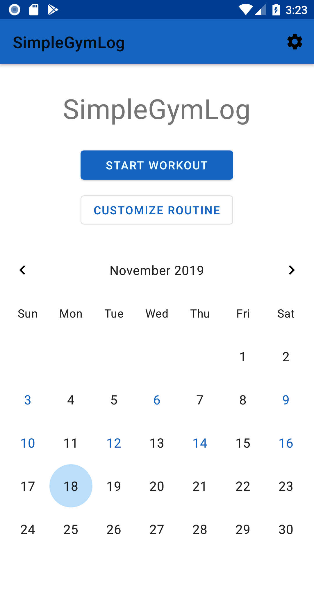

# SimpleGymLog

SimpleGymLog is a workout tracker with a focus on simplicity.
I have written this app because there was no free app with clean interface, that would let you create exercises based on % of [One-Repetition Maximum](https://en.wikipedia.org/wiki/One-repetition_maximum).

  

**What you need to know about this app:**
- free
- clean and simple
- create your own routines to begin workout ASAP
- [b]exercise based on 1RM[/b]
- ad free
- open source

## Licsensing
SimpleGymLog is licensed under the [GNU v3 Public License](/LICENSE). 

